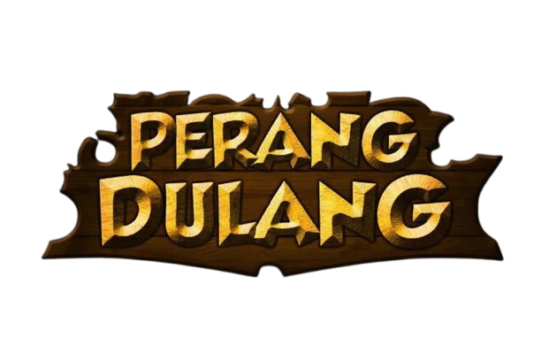
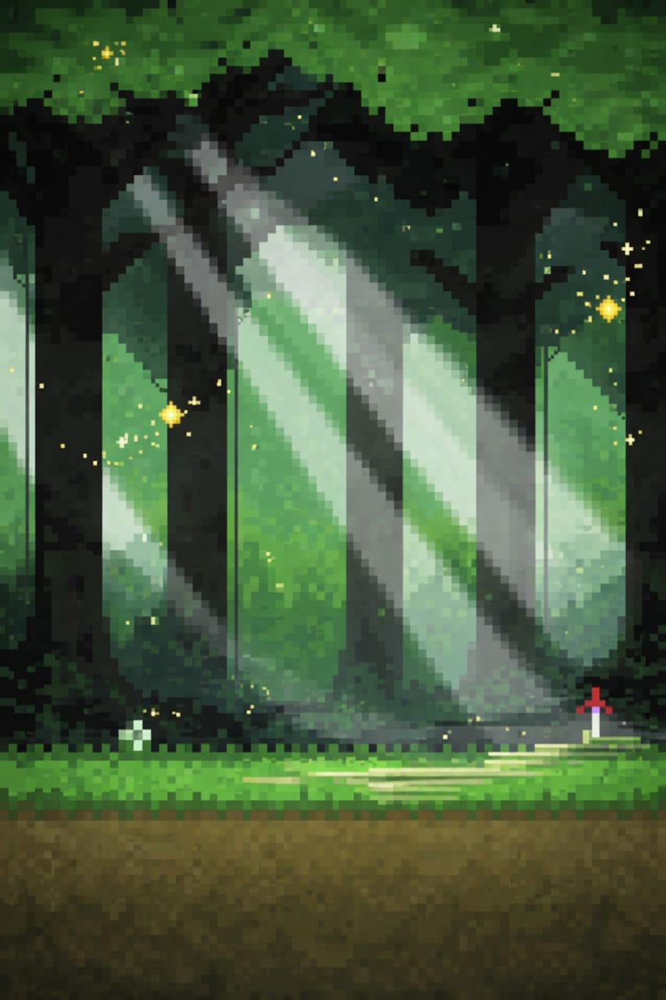
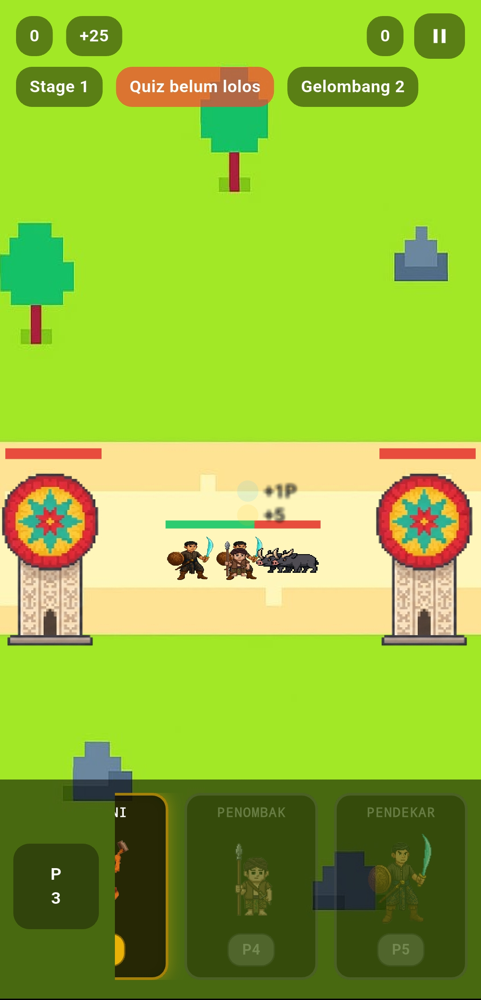

<p align="center">
  
</p>

<h1 align="center">🥁 Perang Dulang Game</h1>

<p align="center">
  Game Edukasi Budaya Bangka Belitung berbasis Flutter & Flame Engine
</p>
# 🥁 Perang Dulang Game

Game edukasi berbasis Flutter dan Flame Engine yang mengangkat budaya **Perang Dulang Bangka Belitung** ke dalam bentuk permainan strategi sederhana bergaya **Lane Battle**.

Pemain harus mengatur strategi dengan memanggil unit, mempertahankan markas, mengalahkan musuh, serta menjawab kuis budaya untuk memperoleh keuntungan selama permainan berlangsung.

---

## 📖 Deskripsi

Perang Dulang Game merupakan game 2D yang dikembangkan menggunakan Flutter dan Flame Engine. Game ini menggabungkan unsur hiburan, strategi, dan edukasi budaya lokal Bangka Belitung.

Konsep permainan terinspirasi dari mekanisme lane battle, di mana pemain dan musuh saling mengirim pasukan untuk menghancurkan markas lawan. Selain itu, terdapat kuis budaya yang bertujuan memperkenalkan tradisi Perang Dulang kepada pemain.

---

## ✨ Fitur Utama

* 🎮 Gameplay strategi lane battle
* 🏰 Sistem pertahanan markas (Base System)
* ⚔️ Spawn berbagai jenis unit
* 🤖 AI musuh otomatis
* 🧠 Kuis edukasi budaya
* 🏆 Sistem High Score
* ⏸️ Pause dan Resume Game
* 🎵 Background Music dan Sound Effect
* 🎉 Victory dan Defeat Screen
* ⚙️ Menu Pengaturan
* 👥 Halaman Kredit Pengembang

---

## 🛠️ Teknologi yang Digunakan

| Teknologi    | Keterangan               |
| ------------ | ------------------------ |
| Flutter      | Framework utama aplikasi |
| Dart         | Bahasa pemrograman       |
| Flame Engine | Framework game 2D        |
| Flame Audio  | Pengelolaan audio game   |

---

## 📂 Struktur Project

```text
lib/
├── game/
│   ├── battle_game.dart
│   ├── components/
│   │   ├── background_component.dart
│   │   ├── base_component.dart
│   │   ├── unit_component.dart
│   │   ├── unit_enemy_component.dart
│   │   ├── coin_fx.dart
│   │   └── reward_fx.dart
│   └── model/
│       ├── unit_config.dart
│       └── unit_type.dart
│
├── ui/
│   ├── start_overlay.dart
│   ├── hud_overlay.dart
│   ├── quiz_overlay.dart
│   ├── pause_overlay.dart
│   ├── victory_overlay.dart
│   ├── defeat_overlay.dart
│   ├── hscore_overlay.dart
│   ├── setting_overlay.dart
│   └── credits_overlay.dart
│
└── main.dart
```

---

## 🎮 Gameplay

1. Pemain memulai permainan dari halaman utama.
2. Kumpulkan resource untuk memanggil unit.
3. Kirim pasukan menuju markas musuh.
4. Pertahankan markas sendiri dari serangan lawan.
5. Jawab kuis yang muncul untuk mendapatkan keuntungan tambahan.
6. Hancurkan markas musuh untuk memenangkan permainan.

---

## 🖼️ Asset Game

### Karakter Pemain

* Farmer
* Swordman
* Spearman

### Musuh

* Babi Hutan
* Biawak Api
* Buaya

### Audio

* Background Music
* Start Sound Effect

---

## 🚀 Cara Menjalankan Project

### Clone Repository

```bash
git clone https://github.com/fullyies/perang-dulang-game.git
```

### Masuk ke Folder Project

```bash
cd perang-dulang-game
```

### Install Dependency

```bash
flutter pub get
```

### Jalankan Aplikasi

```bash
flutter run
```

---

## 📸 Screenshot

```markdown






```

---

## 🎯 Tujuan Pengembangan

* Memperkenalkan budaya Perang Dulang kepada generasi muda.
* Mengembangkan media pembelajaran yang lebih interaktif.
* Mengimplementasikan teknologi Flutter dan Flame Engine dalam pengembangan game edukasi.

---

## 👨‍💻 Tim Pengembang

* Rafi
* Jeki
* Dikko
* Habibi
* Riduan
* Fatir

---

## 📄 Lisensi

Project ini dibuat untuk kebutuhan pembelajaran dan pengembangan akademik.

MIT License © 2026
